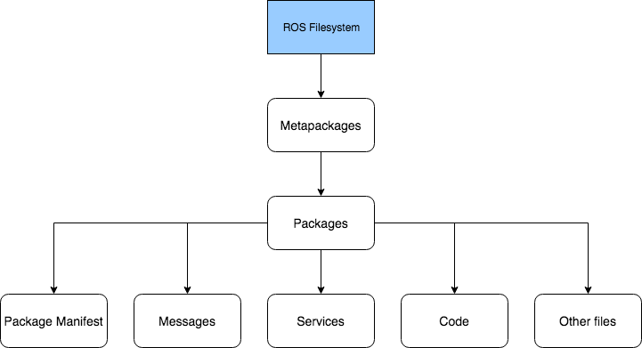

# course

For material pertaining to the Perth ROS workshop.

## ROS Overview

The ROS architecture consists of three levels of concepts:

1. Filesystem Architecture
2. Computational Graph
3. Community

Let's have a brief look at each of these levels.

### Filesystem Architecture

Consists of concepts which tell how a ROS system is formed, including its
folder structure and the minimum number it needs to work with.

* Useful Commands : rospack, catkin_create_pkg, catkin_make, rosdep, roscd,
rosed, roscp, rosd, rosls

### Computational Graph

Provides information about the how the various components in a ROS project come
together to perform an action. Primarily, this level tells us how ROS sets up
and handles the communication between various processes.

* Useful Commands : roscore, rosnode, rostopic, rosrun, rosservice, rosmsg, rosbag

### Community

ROS community is an active open-source organisation sharing knowledge,
algorithms, code packages from any developer. It allows us to _overlay_ and
experiment a package from one developer on top of our developed packages. These
resources include:

* Distributions
* Repositories
* The ROS Wiki
* Bug Ticket System
* Mailing List
* ROS Answers
* Blog
