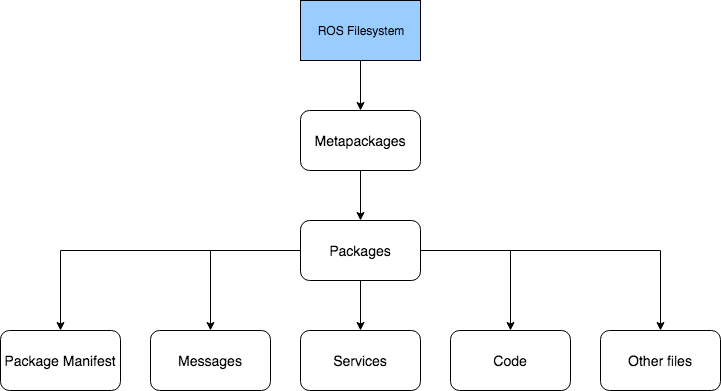
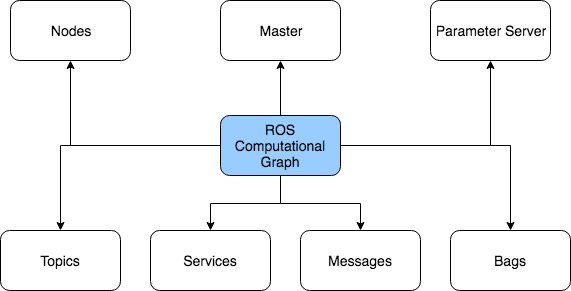

# ROS Introduction

A brief introduction of the ROS system.

## Overview

The ROS architecture consists of three levels of concepts:

1. Filesystem Architecture
2. Computational Graph
3. Community

Let's have a brief look at each of these levels.

### Filesystem Architecture

Consists of concepts which tell how a ROS system is formed, including its
folder structure and the minimum number of files it needs to work with.

- **Useful Commands** : [`rospack`][cmd-rospack], [`catkin_create_pkg`][cmd-catkin_create_pkg], [`catkin build`][cmd-catkin-build], [`rosdep`][cmd-rosdep], [`roscd`][cmd-roscd], [`rosed`][cmd-rosed], [`roscp`][cmd-roscp], [`rosd`][cmd-rosd], [`rosls`][cmd-rosls]
- **More information**: http://wiki.ros.org/ROS/Concepts#ROS_Filesystem_Level

### Computational Graph

Provides information about how various components in a ROS project come
together to perform an action. Primarily, this level tells us how ROS sets up
and handles the communication between various processes.

- **Useful Commands** : [`roscore`][cmd-roscore], [`rosnode`][cmd-rosnode], [`rostopic`][cmd-rostopic], [`rosrun`][cmd-rosrun], [`rosservice`][cmd-rosservice], [`rosmsg`][cmd-rosmsg], [`rosbag`][cmd-rosbag]
- **More information**: http://wiki.ros.org/ROS/Concepts#ROS_Computation_Graph_Level

### Community

ROS has an active open-source community sharing knowledge, algorithms, code and packages from thousands of developers around the world. It allows us experiment with other developers' code and collaborate using a variety of resources including:

- **Distributions** : Similar to Linux distributions or Windows OS versions, ROS
distributions provide updates made to its core-system by the community (http://wiki.ros.org/Distributions)
- **Repositories** : ROS' federated network of institutions or organisations develop
and release their own robotics components as repositories (e.g. [cartographer](http://wiki.ros.org/cartographer?distro=melodic))
- **The ROS Wiki** : Contains documentation about ROS and provides a forum for the
ROS community to contribute via documentation updates, tutorials, etc. (http://wiki.ros.org/)
- **ROS Discourse** : A ROS community forum (https://discourse.ros.org)
- **Bug Ticket System** : Way to enable ROS users to apply bug-fixes on any of the ROS codebase. Currently, this is done via pull-requests on respective Git repositories
- **Mailing List** : `ros-users` mailing list provides regular updates on ROS (http://lists.ros.org/mailman/listinfo/ros-users)
- **ROS Answers** : Question-Answer forum where users are encouraged to ask and answer questions (http://answers.ros.org)
- **Blog** : Regular photos, updates and news articles about ROS (http://ros.org/news)

## References

1. **ROS Concepts** : http://wiki.ros.org/ROS/Concepts
2. **ROS Cheat Sheets**
    - Clearpath Robotics Inc. : https://www.clearpathrobotics.com/ros-robot-operating-system-cheat-sheet/
    - James Madison University Robotics Lab : [ROS Kinetic Cheatsheet](https://w3.cs.jmu.edu/spragunr/CS354/handouts/ROSCheatsheet.pdf)

[cmd-rospack]: http://wiki.ros.org/rospack?distro=noetic
[cmd-catkin_create_pkg]: http://wiki.ros.org/catkin/commands/catkin_create_pkg
[cmd-catkin-build]: https://catkin-tools.readthedocs.io/en/latest/installing.html 
[cmd-rosdep]: http://wiki.ros.org/rosdep
[cmd-roscd]: http://wiki.ros.org/rosbash?distro=noetic#roscd
[cmd-rosed]: http://wiki.ros.org/rosbash?distro=noetic#rosed
[cmd-roscp]: http://wiki.ros.org/rosbash?distro=noetic#roscp
[cmd-rosd]: http://wiki.ros.org/rosbash?distro=noetic#rosd
[cmd-rosls]: http://wiki.ros.org/rosbash?distro=noetic#rosls

[cmd-roscore]: http://wiki.ros.org/roscore
[cmd-rosnode]: http://wiki.ros.org/rosnode?distro=noetic
[cmd-rostopic]: http://wiki.ros.org/rostopic?distro=noetic
[cmd-rosrun]: http://wiki.ros.org/rosbash?distro=noetic#rosrun
[cmd-rosservice]: http://wiki.ros.org/rosservice?distro=noetic
[cmd-rosmsg]: http://wiki.ros.org/rosmsg?distro=noetic
[cmd-rosbag]: http://wiki.ros.org/rosbag?distro=noetic

